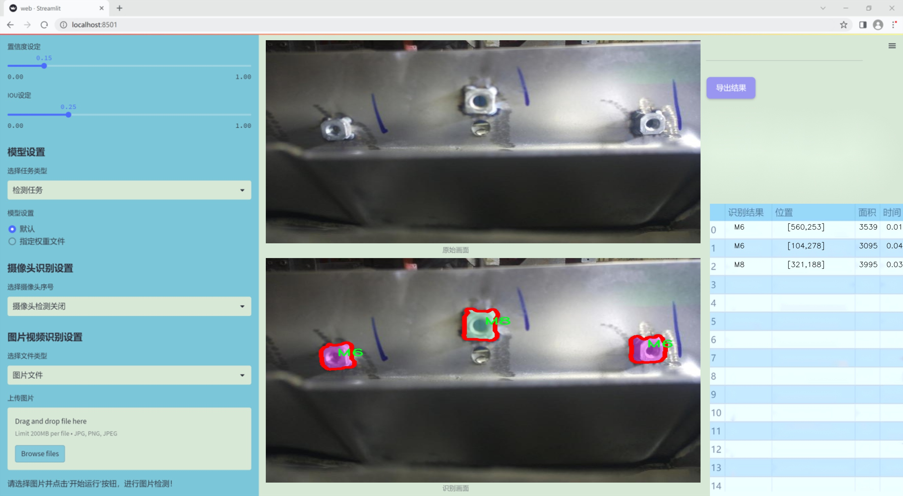
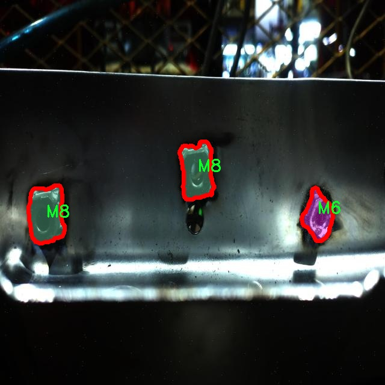

### 1.背景意义

研究背景与意义

随着工业自动化和智能制造的迅速发展，精确的零部件识别与分类在生产流程中变得愈发重要。螺栓作为机械连接中不可或缺的基本元件，其尺寸识别对于确保产品质量和装配精度具有重要意义。传统的螺栓尺寸识别方法往往依赖于人工检测或简单的图像处理技术，这不仅效率低下，而且容易受到人为因素的影响，导致识别准确率低下。因此，基于深度学习的计算机视觉技术在螺栓尺寸识别中的应用显得尤为必要。

YOLO（You Only Look Once）系列模型因其高效的实时目标检测能力而广受欢迎。YOLOv11作为该系列的最新版本，结合了更先进的网络结构和算法优化，能够在保持高精度的同时显著提高检测速度。通过对YOLOv11进行改进，特别是在实例分割任务中的应用，可以实现对螺栓尺寸的精确识别与分割，从而为后续的自动化装配和质量控制提供有力支持。

本研究基于一个包含1500张图像的螺栓数据集，涵盖了M6和M8两种螺栓类别，旨在构建一个高效的螺栓尺寸识别实例分割系统。该数据集经过精心标注，能够为模型训练提供丰富的样本，确保模型在实际应用中的鲁棒性和准确性。通过对YOLOv11的改进，期望能够提升模型在复杂背景下的识别能力，进而推动智能制造领域的技术进步。

综上所述，基于改进YOLOv11的螺栓尺寸识别实例分割系统的研究，不仅能够提升工业生产中的自动化水平，还能为相关领域的研究提供新的思路和方法，具有重要的理论价值和实际应用意义。

### 2.视频效果

[2.1 视频效果](https://www.bilibili.com/video/BV1uWrfYoEKf/)

### 3.图片效果




##### [项目涉及的源码数据来源链接](https://kdocs.cn/l/cszuIiCKVNis)**

注意：本项目提供训练的数据集和训练教程,由于版本持续更新,暂不提供权重文件（best.pt）,请按照6.训练教程进行训练后实现上图演示的效果。

### 4.数据集信息

##### 4.1 本项目数据集类别数＆类别名

nc: 2
names: ['M6', 'M8']


该项目为【图像分割】数据集，请在【训练教程和Web端加载模型教程（第三步）】这一步的时候按照【图像分割】部分的教程来训练

##### 4.2 本项目数据集信息介绍

本项目数据集信息介绍

本项目旨在开发一个改进版的YOLOv11模型，以实现高效的螺栓尺寸识别和实例分割。为此，我们构建了一个专门的数据集，涵盖了两种主要类别的螺栓：M6和M8。这两种螺栓广泛应用于机械工程和建筑领域，因其在连接和固定结构中的重要性而备受关注。数据集的构建过程经过精心设计，确保了数据的多样性和代表性，以便模型能够在实际应用中表现出色。

数据集包含了大量的图像样本，这些样本在不同的光照条件、背景环境和角度下拍摄，力求覆盖螺栓在实际使用中可能遇到的各种情况。每个图像都经过标注，明确指出了M6和M8螺栓的位置和尺寸信息。这种细致的标注不仅有助于模型的训练，也为后续的实例分割任务提供了可靠的基础。

在数据集的构建过程中，我们特别关注了图像的质量和标注的准确性。每个类别的样本数量经过精心平衡，以避免模型在训练过程中出现偏倚现象。此外，数据集还包括了一些难度较大的样本，例如在复杂背景下的螺栓图像，这将有助于提高模型的鲁棒性和泛化能力。

通过对该数据集的训练，我们期望改进YOLOv11在螺栓尺寸识别和实例分割任务中的性能，使其能够更准确地识别和分割不同尺寸的螺栓。这将为工业自动化和智能制造提供强有力的技术支持，推动相关领域的进一步发展。





### 5.全套项目环境部署视频教程（零基础手把手教学）

[5.1 所需软件PyCharm和Anaconda安装教程（第一步）](https://www.bilibili.com/video/BV1BoC1YCEKi/?spm_id_from=333.999.0.0&vd_source=bc9aec86d164b67a7004b996143742dc)


[5.2 安装Python虚拟环境创建和依赖库安装视频教程（第二步）](https://www.bilibili.com/video/BV1ZoC1YCEBw?spm_id_from=333.788.videopod.sections&vd_source=bc9aec86d164b67a7004b996143742dc)

### 6.改进YOLOv11训练教程和Web_UI前端加载模型教程（零基础手把手教学）

[6.1 改进YOLOv11训练教程和Web_UI前端加载模型教程（第三步）](https://www.bilibili.com/video/BV1BoC1YCEhR?spm_id_from=333.788.videopod.sections&vd_source=bc9aec86d164b67a7004b996143742dc)


按照上面的训练视频教程链接加载项目提供的数据集，运行train.py即可开始训练



     Epoch   gpu_mem       box       obj       cls    labels  img_size
     1/200     20.8G   0.01576   0.01955  0.007536        22      1280: 100%|██████████| 849/849 [14:42<00:00,  1.04s/it]
               Class     Images     Labels          P          R     mAP@.5 mAP@.5:.95: 100%|██████████| 213/213 [01:14<00:00,  2.87it/s]
                 all       3395      17314      0.994      0.957      0.0957      0.0843

     Epoch   gpu_mem       box       obj       cls    labels  img_size
     2/200     20.8G   0.01578   0.01923  0.007006        22      1280: 100%|██████████| 849/849 [14:44<00:00,  1.04s/it]
               Class     Images     Labels          P          R     mAP@.5 mAP@.5:.95: 100%|██████████| 213/213 [01:12<00:00,  2.95it/s]
                 all       3395      17314      0.996      0.956      0.0957      0.0845

     Epoch   gpu_mem       box       obj       cls    labels  img_size
     3/200     20.8G   0.01561    0.0191  0.006895        27      1280: 100%|██████████| 849/849 [10:56<00:00,  1.29it/s]
               Class     Images     Labels          P          R     mAP@.5 mAP@.5:.95: 100%|███████   | 187/213 [00:52<00:00,  4.04it/s]
                 all       3395      17314      0.996      0.957      0.0957      0.0845


###### [项目数据集下载链接](https://kdocs.cn/l/cszuIiCKVNis)

### 7.原始YOLOv11算法讲解

##### YOLO11简介

> YOLO11源码地址：https://github.com/ultralytics/ultralytics

Ultralytics
YOLO11是一款尖端的、最先进的模型，它在之前YOLO版本成功的基础上进行了构建，并引入了新功能和改进，以进一步提升性能和灵活性。YOLO11设计快速、准确且易于使用，使其成为各种物体检测和跟踪、实例分割、图像分类以及姿态估计任务的绝佳选择。  


**YOLO11创新点如下:**

YOLO 11主要改进包括：  
`增强的特征提取`：YOLO 11采用了改进的骨干和颈部架构，增强了特征提取功能，以实现更精确的目标检测。  
`优化的效率和速度`：优化的架构设计和优化的训练管道提供更快的处理速度，同时保持准确性和性能之间的平衡。  
`更高的精度，更少的参数`：YOLO11m在COCO数据集上实现了更高的平均精度（mAP），参数比YOLOv8m少22%，使其在不影响精度的情况下提高了计算效率。  
`跨环境的适应性`：YOLO 11可以部署在各种环境中，包括边缘设备、云平台和支持NVIDIA GPU的系统。  
`广泛的支持任务`：YOLO 11支持各种计算机视觉任务，如对象检测、实例分割、图像分类、姿态估计和面向对象检测（OBB）。

**YOLO11不同模型尺寸信息：**

YOLO11 提供5种不同的型号规模模型，以满足不同的应用需求：

Model| size (pixels)| mAPval 50-95| Speed CPU ONNX (ms)| Speed T4 TensorRT10
(ms)| params (M)| FLOPs (B)  
---|---|---|---|---|---|---  
YOLO11n| 640| 39.5| 56.1 ± 0.8| 1.5 ± 0.0| 2.6| 6.5  
YOLO11s| 640| 47.0| 90.0 ± 1.2| 2.5 ± 0.0| 9.4| 21.5  
YOLO11m| 640| 51.5| 183.2 ± 2.0| 4.7 ± 0.1| 20.1| 68.0  
YOLO11l| 640| 53.4| 238.6 ± 1.4| 6.2 ± 0.1| 25.3| 86.9  
YOLO11x| 640| 54.7| 462.8 ± 6.7| 11.3 ± 0.2| 56.9| 194.9  
  
**模型常用训练超参数参数说明：**  
`YOLOv11
模型的训练设置包括训练过程中使用的各种超参数和配置`。这些设置会影响模型的性能、速度和准确性。关键的训练设置包括批量大小、学习率、动量和权重衰减。此外，优化器、损失函数和训练数据集组成的选择也会影响训练过程。对这些设置进行仔细的调整和实验对于优化性能至关重要。  
**以下是一些常用的模型训练参数和说明：**

参数名| 默认值| 说明  
---|---|---  
`model`| `None`| 指定用于训练的模型文件。接受指向 `.pt` 预训练模型或 `.yaml`
配置文件。对于定义模型结构或初始化权重至关重要。  
`data`| `None`| 数据集配置文件的路径（例如
`coco8.yaml`).该文件包含特定于数据集的参数，包括训练数据和验证数据的路径、类名和类数。  
`epochs`| `100`| 训练总轮数。每个epoch代表对整个数据集进行一次完整的训练。调整该值会影响训练时间和模型性能。  
`patience`| `100`| 在验证指标没有改善的情况下，提前停止训练所需的epoch数。当性能趋于平稳时停止训练，有助于防止过度拟合。  
`batch`| `16`| 批量大小，有三种模式:设置为整数(例如，’ Batch =16 ‘)， 60% GPU内存利用率的自动模式(’ Batch
=-1 ‘)，或指定利用率分数的自动模式(’ Batch =0.70 ')。  
`imgsz`| `640`| 用于训练的目标图像尺寸。所有图像在输入模型前都会被调整到这一尺寸。影响模型精度和计算复杂度。  
`device`| `None`| 指定用于训练的计算设备：单个 GPU (`device=0`）、多个 GPU (`device=0,1`)、CPU
(`device=cpu`)，或苹果芯片的 MPS (`device=mps`).  
`workers`| `8`| 加载数据的工作线程数（每 `RANK` 多 GPU 训练）。影响数据预处理和输入模型的速度，尤其适用于多 GPU 设置。  
`name`| `None`| 训练运行的名称。用于在项目文件夹内创建一个子目录，用于存储训练日志和输出结果。  
`pretrained`| `True`| 决定是否从预处理模型开始训练。可以是布尔值，也可以是加载权重的特定模型的字符串路径。提高训练效率和模型性能。  
`optimizer`| `'auto'`| 为训练模型选择优化器。选项包括 `SGD`, `Adam`, `AdamW`, `NAdam`,
`RAdam`, `RMSProp` 等，或 `auto` 用于根据模型配置进行自动选择。影响收敛速度和稳定性  
`lr0`| `0.01`| 初始学习率（即 `SGD=1E-2`, `Adam=1E-3`) .调整这个值对优化过程至关重要，会影响模型权重的更新速度。  
`lrf`| `0.01`| 最终学习率占初始学习率的百分比 = (`lr0 * lrf`)，与调度程序结合使用，随着时间的推移调整学习率。  


**各损失函数作用说明：**  
`定位损失box_loss`：预测框与标定框之间的误差（GIoU），越小定位得越准；  
`分类损失cls_loss`：计算锚框与对应的标定分类是否正确，越小分类得越准；  
`动态特征损失（dfl_loss）`：DFLLoss是一种用于回归预测框与目标框之间距离的损失函数。在计算损失时，目标框需要缩放到特征图尺度，即除以相应的stride，并与预测的边界框计算Ciou
Loss，同时与预测的anchors中心点到各边的距离计算回归DFLLoss。  


### 8.200+种全套改进YOLOV11创新点原理讲解

#### 8.1 200+种全套改进YOLOV11创新点原理讲解大全

由于篇幅限制，每个创新点的具体原理讲解就不全部展开，具体见下列网址中的改进模块对应项目的技术原理博客网址【Blog】（创新点均为模块化搭建，原理适配YOLOv5~YOLOv11等各种版本）

[改进模块技术原理博客【Blog】网址链接](https://gitee.com/qunmasj/good)


#### 8.2 精选部分改进YOLOV11创新点原理讲解

###### 这里节选部分改进创新点展开原理讲解(完整的改进原理见上图和[改进模块技术原理博客链接](https://gitee.com/qunmasj/good)【如果此小节的图加载失败可以通过CSDN或者Github搜索该博客的标题访问原始博客，原始博客图片显示正常】

### ParC融合位置感知循环卷积简介
ParC：Position aware circular convolution


#### Position aware circular convolution
针对于全局信息的提取作者提出了Position aware circular convolution（也称作Global Circular Convolution）。图中左右实际是对于该操作水平竖直两方向的对称，理解时只看左边即可。对于维度为C*H*W的输入，作者先将维度为C*B*1的Position Embedding通过双线性插值函数F调整到适合input的维度C*H*1（以适应不同特征大小输入），并且将PE水平复制扩展到C*H*W维度与输入特征相加。这里作者将PE直接设置成为了可学习的参数。

接下来参考该博客将加入PE的特征图竖直方向堆叠，并且同样以插值的方式得到了适应输入维度的C*H*1大小的卷积核，进行卷积操作。对于这一步卷积，作者将之称为循环卷积，并给出了一个卷积示意图。


但个人感觉实际上这个示意图只是为了说明为什么叫循环卷积，对于具体的计算细节还是根据公式理解更好。


进一步，作者给出了这一步的伪代码来便于读者对这一卷积的理解：y=F.conv2D（torch.cat（xp，xp，dim=2），kV），实际上就是将xp堆叠之后使用了一个“条形（或柱形）”卷积核进行简单的卷积操作。（但这样会导致多一次重复卷积，因此在堆叠示意图中只取了前2*H-1行）

可以看到在示意图中特征维度变化如下：C*(2H-1)*W ---C*H*1--->C*H*W，作者特意带上了通道数，并且并没有出现通道数的改变，那么这里所进行的卷积应该是depth wise卷积，通过对文章后续以及论文源码的阅读可以得知这一步进行的就是DW卷积。（we introduce group convolution and point wise convolution into these modules, which decreases number of parameters without hurting performance.）


由groups = channel可知使用的是DW卷积
通过上面就完成了一次竖直方向的全局信息交流，同样只要在水平方向进行同样的操作即可做到水平方向的全局信息交流。

#### ParC block

通过ParC成功解决了全局信息提取的问题，接下来就是针对2）3）两点进行改进。首先是Meta-Former模块，Meta-Former由Token Mixer和Channel Mixer构成，ParC首先满足了Token Mixer的全局信息提取的要求，并且相较于Attention在计算成本上更低。


这里①中的PWC即point wise conv，进一步验证了我们前面对于深度可分离卷积的想法，而GCC-H/V即是前面所说的ParC-H/V。

①构建了Meta-Former中的Token mixer模块，那么最后剩下的问题就是3），替换掉Attention模块之后模型不再data driven。为了解决这一点作者给出了一个channel wise attention，先将特征图（x,C*H*W）进行global average（a,C*1*1）并输入一个MLP生成一个channel wise的权重（w,C*1*1），再将权重与特征图在通道方向相乘得到输出（output = wx,C*H*W）。

#### ParC net
对于ParC net 的搭建，作者直接基于MobileViT，采用了分叉结构（c）完成了网络的搭建。


具体而言作者保留了MobileViT中浅层具有局部感受野的MobileNetV2结构，而将网络深层的ViT block替换成了ParC block，使网络变成了一个pure ConvNet。


### 9.系统功能展示

图9.1.系统支持检测结果表格显示

  图9.2.系统支持置信度和IOU阈值手动调节

  图9.3.系统支持自定义加载权重文件best.pt(需要你通过步骤5中训练获得)

  图9.4.系统支持摄像头实时识别

  图9.5.系统支持图片识别

  图9.6.系统支持视频识别

  图9.7.系统支持识别结果文件自动保存

  图9.8.系统支持Excel导出检测结果数据


### 10. YOLOv11核心改进源码讲解

#### 10.1 RFAConv.py

以下是代码中最核心的部分，并附上详细的中文注释：

```python
import torch
import torch.nn as nn
from einops import rearrange

# 定义一个h_sigmoid激活函数
class h_sigmoid(nn.Module):
    def __init__(self, inplace=True):
        super(h_sigmoid, self).__init__()
        self.relu = nn.ReLU6(inplace=inplace)  # 使用ReLU6作为基础

    def forward(self, x):
        return self.relu(x + 3) / 6  # 计算h_sigmoid

# 定义一个h_swish激活函数
class h_swish(nn.Module):
    def __init__(self, inplace=True):
        super(h_swish, self).__init__()
        self.sigmoid = h_sigmoid(inplace=inplace)  # 使用h_sigmoid作为基础

    def forward(self, x):
        return x * self.sigmoid(x)  # 计算h_swish

# 定义RFAConv类
class RFAConv(nn.Module):
    def __init__(self, in_channel, out_channel, kernel_size, stride=1):
        super().__init__()
        self.kernel_size = kernel_size

        # 用于获取权重的卷积和池化层
        self.get_weight = nn.Sequential(
            nn.AvgPool2d(kernel_size=kernel_size, padding=kernel_size // 2, stride=stride),
            nn.Conv2d(in_channel, in_channel * (kernel_size ** 2), kernel_size=1, groups=in_channel, bias=False)
        )
        
        # 生成特征的卷积层
        self.generate_feature = nn.Sequential(
            nn.Conv2d(in_channel, in_channel * (kernel_size ** 2), kernel_size=kernel_size, padding=kernel_size // 2, stride=stride, groups=in_channel, bias=False),
            nn.BatchNorm2d(in_channel * (kernel_size ** 2)),
            nn.ReLU()
        )
        
        # 最终的卷积层
        self.conv = nn.Conv2d(in_channel, out_channel, kernel_size=kernel_size, stride=kernel_size)

    def forward(self, x):
        b, c = x.shape[0:2]  # 获取批量大小和通道数
        weight = self.get_weight(x)  # 获取权重
        h, w = weight.shape[2:]  # 获取特征图的高和宽
        
        # 计算权重并进行softmax归一化
        weighted = weight.view(b, c, self.kernel_size ** 2, h, w).softmax(2)
        feature = self.generate_feature(x).view(b, c, self.kernel_size ** 2, h, w)  # 生成特征
        
        # 加权特征
        weighted_data = feature * weighted
        conv_data = rearrange(weighted_data, 'b c (n1 n2) h w -> b c (h n1) (w n2)', n1=self.kernel_size, n2=self.kernel_size)  # 重排数据
        return self.conv(conv_data)  # 返回卷积结果

# 定义SE（Squeeze-and-Excitation）模块
class SE(nn.Module):
    def __init__(self, in_channel, ratio=16):
        super(SE, self).__init__()
        self.gap = nn.AdaptiveAvgPool2d((1, 1))  # 全局平均池化
        self.fc = nn.Sequential(
            nn.Linear(in_channel, ratio, bias=False),  # 从 c -> c/r
            nn.ReLU(),
            nn.Linear(ratio, in_channel, bias=False),  # 从 c/r -> c
            nn.Sigmoid()
        )

    def forward(self, x):
        b, c = x.shape[0:2]  # 获取批量大小和通道数
        y = self.gap(x).view(b, c)  # 进行全局平均池化
        y = self.fc(y).view(b, c, 1, 1)  # 通过全连接层
        return y  # 返回通道注意力

# 定义RFCBAMConv类
class RFCBAMConv(nn.Module):
    def __init__(self, in_channel, out_channel, kernel_size=3, stride=1):
        super().__init__()
        self.kernel_size = kernel_size
        
        # 生成特征的卷积层
        self.generate = nn.Sequential(
            nn.Conv2d(in_channel, in_channel * (kernel_size ** 2), kernel_size, padding=kernel_size // 2, stride=stride, groups=in_channel, bias=False),
            nn.BatchNorm2d(in_channel * (kernel_size ** 2)),
            nn.ReLU()
        )
        
        # 用于获取权重的卷积层
        self.get_weight = nn.Sequential(nn.Conv2d(2, 1, kernel_size=3, padding=1, bias=False), nn.Sigmoid())
        self.se = SE(in_channel)  # 初始化SE模块

        # 最终的卷积层
        self.conv = nn.Conv2d(in_channel, out_channel, kernel_size=kernel_size, stride=kernel_size)

    def forward(self, x):
        b, c = x.shape[0:2]  # 获取批量大小和通道数
        channel_attention = self.se(x)  # 计算通道注意力
        generate_feature = self.generate(x)  # 生成特征

        h, w = generate_feature.shape[2:]  # 获取特征图的高和宽
        generate_feature = generate_feature.view(b, c, self.kernel_size ** 2, h, w)  # 重排特征
        
        # 重排特征以便进行卷积
        generate_feature = rearrange(generate_feature, 'b c (n1 n2) h w -> b c (h n1) (w n2)', n1=self.kernel_size, n2=self.kernel_size)
        
        # 加权特征
        unfold_feature = generate_feature * channel_attention
        max_feature, _ = torch.max(generate_feature, dim=1, keepdim=True)  # 最大特征
        mean_feature = torch.mean(generate_feature, dim=1, keepdim=True)  # 平均特征
        
        # 计算接收场注意力
        receptive_field_attention = self.get_weight(torch.cat((max_feature, mean_feature), dim=1))
        conv_data = unfold_feature * receptive_field_attention  # 加权特征
        return self.conv(conv_data)  # 返回卷积结果
```

### 代码核心部分分析
1. **激活函数**：`h_sigmoid` 和 `h_swish` 是自定义的激活函数，分别实现了h-sigmoid和h-swish的功能，主要用于神经网络中的非线性变换。

2. **RFAConv**：该类实现了一种卷积操作，结合了特征生成和权重计算，通过对特征进行加权来增强特征表达能力。

3. **SE模块**：Squeeze-and-Excitation模块用于计算通道注意力，通过全局平均池化和全连接层实现通道的自适应重标定。

4. **RFCBAMConv**：结合了特征生成、通道注意力和接收场注意力的卷积模块，进一步增强了特征的表达能力。

这些模块可以用于构建更复杂的神经网络架构，提升模型在图像处理等任务中的性能。

这个程序文件`RFAConv.py`主要实现了一些基于卷积神经网络的模块，包含了自定义的激活函数、卷积层以及注意力机制。代码中定义了几个类，包括`h_sigmoid`、`h_swish`、`RFAConv`、`SE`、`RFCBAMConv`和`RFCAConv`，每个类都有其特定的功能。

首先，`h_sigmoid`和`h_swish`是自定义的激活函数，分别实现了`h-sigmoid`和`h-swish`。`h_sigmoid`使用了`ReLU6`函数来限制输出范围，而`h_swish`则是将输入与`h_sigmoid`的输出相乘，形成一种新的激活方式。

接下来是`RFAConv`类，它实现了一种新的卷积层，结合了特征生成和加权机制。该类的构造函数中定义了两个主要的序列模块：`get_weight`和`generate_feature`。`get_weight`通过平均池化和卷积操作生成权重，而`generate_feature`则通过卷积、批归一化和ReLU激活生成特征。`forward`方法中，输入经过这些模块后，生成的特征和权重被结合，最终通过一个卷积层输出结果。

`SE`类实现了Squeeze-and-Excitation（SE）模块，它通过全局平均池化和全连接层来生成通道注意力权重。该模块能够增强网络对重要特征的关注。

`RFCBAMConv`类是一个结合了通道注意力和空间注意力的卷积模块。它首先生成特征，然后通过SE模块计算通道注意力，再通过最大池化和平均池化生成的特征计算空间注意力。最终，生成的特征与注意力权重相乘，并通过卷积层输出。

最后，`RFCAConv`类实现了一种新的卷积结构，结合了空间和通道的注意力机制。它通过生成特征并分别进行水平和垂直的自适应平均池化，生成的特征经过一系列卷积和激活函数处理后，计算出注意力权重，最终将这些权重应用于生成的特征上。

整体来看，这个文件中的模块设计旨在提升卷积神经网络的特征提取能力，特别是在处理图像数据时，通过注意力机制使得网络能够更好地关注重要的特征区域。

#### 10.2 revcol.py

以下是代码中最核心的部分，并附上详细的中文注释：

```python
import torch
import torch.nn as nn

# 定义一个反向传播的自定义函数
class ReverseFunction(torch.autograd.Function):
    @staticmethod
    def forward(ctx, run_functions, alpha, *args):
        # 提取传入的函数和参数
        l0, l1, l2, l3 = run_functions
        alpha0, alpha1, alpha2, alpha3 = alpha
        
        # 保存上下文信息
        ctx.run_functions = run_functions
        ctx.alpha = alpha
        
        # 断开梯度计算
        with torch.no_grad():
            # 执行前向传播
            c0 = l0(args[0], args[1]) + args[2] * alpha0
            c1 = l1(c0, args[3]) + args[4] * alpha1
            c2 = l2(c1, args[5]) + args[6] * alpha2
            c3 = l3(c2, None) + args[7] * alpha3
        
        # 保存中间结果以便后向传播使用
        ctx.save_for_backward(args[0], c0, c1, c2, c3)
        return args[0], c0, c1, c2, c3

    @staticmethod
    def backward(ctx, *grad_outputs):
        # 获取保存的中间结果
        x, c0, c1, c2, c3 = ctx.saved_tensors
        l0, l1, l2, l3 = ctx.run_functions
        alpha0, alpha1, alpha2, alpha3 = ctx.alpha
        
        # 计算梯度
        g3_up = grad_outputs[4]
        g2_up = grad_outputs[3] + c2.grad
        g1_up = grad_outputs[2] + c1.grad
        g0_up = grad_outputs[1] + c0.grad
        
        # 反向传播计算
        # 这里省略了具体的反向传播细节，主要是通过链式法则计算各层的梯度
        
        return None, None, g0_up, g1_up, g2_up, g3_up

# 定义一个子网络类
class SubNet(nn.Module):
    def __init__(self, channels, layers, kernel, first_col, save_memory) -> None:
        super().__init__()
        self.save_memory = save_memory
        
        # 定义每一层的 alpha 参数
        self.alpha0 = nn.Parameter(torch.ones((1, channels[0], 1, 1)), requires_grad=True)
        self.alpha1 = nn.Parameter(torch.ones((1, channels[1], 1, 1)), requires_grad=True)
        self.alpha2 = nn.Parameter(torch.ones((1, channels[2], 1, 1)), requires_grad=True)
        self.alpha3 = nn.Parameter(torch.ones((1, channels[3], 1, 1)), requires_grad=True)

        # 初始化每一层
        self.level0 = Level(0, channels, layers, kernel, first_col)
        self.level1 = Level(1, channels, layers, kernel, first_col)
        self.level2 = Level(2, channels, layers, kernel, first_col)
        self.level3 = Level(3, channels, layers, kernel, first_col)

    def forward(self, *args):
        # 根据是否保存内存选择前向传播方式
        if self.save_memory:
            return self._forward_reverse(*args)
        else:
            return self._forward_nonreverse(*args)

# 定义主网络类
class RevCol(nn.Module):
    def __init__(self, kernel='C2f', channels=[32, 64, 96, 128], layers=[2, 3, 6, 3], num_subnet=5, save_memory=True) -> None:
        super().__init__()
        self.num_subnet = num_subnet
        self.channels = channels
        self.layers = layers

        # 初始化输入层
        self.stem = Conv(3, channels[0], k=4, s=4, p=0)

        # 初始化多个子网络
        for i in range(num_subnet):
            first_col = True if i == 0 else False
            self.add_module(f'subnet{str(i)}', SubNet(channels, layers, kernel, first_col, save_memory=save_memory))

    def forward(self, x):
        # 前向传播
        c0, c1, c2, c3 = 0, 0, 0, 0
        x = self.stem(x)        
        for i in range(self.num_subnet):
            c0, c1, c2, c3 = getattr(self, f'subnet{str(i)}')(x, c0, c1, c2, c3)       
        return [c0, c1, c2, c3]
```

### 代码核心部分解释：
1. **ReverseFunction**: 这是一个自定义的反向传播函数，主要用于实现反向传播中的梯度计算。它包含了前向传播和反向传播的逻辑。
   - `forward` 方法：执行前向传播，计算并返回各层的输出。
   - `backward` 方法：计算各层的梯度，并返回。

2. **SubNet**: 这是一个子网络类，包含多个层和参数。根据是否保存内存，选择不同的前向传播方式。

3. **RevCol**: 这是主网络类，负责初始化输入层和多个子网络，并实现前向传播逻辑。

### 总结：
这段代码实现了一个复杂的神经网络结构，结合了自定义的反向传播逻辑，适用于需要高效内存管理和梯度计算的深度学习任务。

这个程序文件 `revcol.py` 是一个使用 PyTorch 框架实现的深度学习模型，主要用于图像处理任务。它的结构比较复杂，包含了多个类和函数，主要实现了一个名为 `RevCol` 的模型，结合了反向传播和特征融合的技术。

首先，文件导入了必要的 PyTorch 模块以及一些自定义的模块。接着，定义了一些辅助函数，比如 `get_gpu_states` 和 `set_device_states`，用于管理 GPU 的随机数生成状态，这在多 GPU 训练时非常重要，以确保每个设备的状态一致。

`detach_and_grad` 函数用于处理输入的张量，确保在反向传播时能够正确计算梯度。它接受一个元组作为输入，返回一个新的元组，其中的张量都被分离（detach）并且设置为需要梯度（requires_grad=True）。

`ReverseFunction` 类是一个自定义的自动求导函数，包含了前向传播和反向传播的逻辑。在前向传播中，它接收多个函数和参数，依次计算并保存中间结果。在反向传播中，它根据保存的中间结果和梯度信息，逐层计算梯度并返回。

`Fusion` 和 `Level` 类用于构建模型的不同层次和融合操作。`Fusion` 类负责在不同层之间进行特征融合，而 `Level` 类则负责构建具体的卷积层。每个 `Level` 包含一个融合模块和多个卷积块。

`SubNet` 类是一个子网络的实现，包含多个层次的处理。它根据输入的参数决定是使用反向传播还是非反向传播的方式进行前向计算。通过 `alpha` 参数控制不同层次的特征融合程度。

`RevCol` 类是整个模型的主体，初始化时设置了多个子网络，并定义了输入的卷积层。它的 `forward` 方法依次调用每个子网络进行处理，最终返回多个特征图。

整个模型设计上结合了深度学习中的反向传播机制和特征融合策略，能够有效地处理图像数据，适用于需要高效特征提取和处理的任务。通过使用自定义的反向传播函数，模型在内存使用和计算效率上进行了优化，适合在多 GPU 环境下运行。

#### 10.3 prepbn.py

以下是代码中最核心的部分，并附上详细的中文注释：

```python
import torch
import torch.nn as nn

# 定义一个自定义的批量归一化类
class RepBN(nn.Module):
    def __init__(self, channels):
        super(RepBN, self).__init__()
        # 初始化一个可学习的参数 alpha，初始值为 1
        self.alpha = nn.Parameter(torch.ones(1))
        # 初始化一个一维批量归一化层
        self.bn = nn.BatchNorm1d(channels)

    def forward(self, x):
        # 将输入的维度进行转置，交换第1维和第2维
        x = x.transpose(1, 2)
        # 进行批量归一化，并加上 alpha 乘以输入 x
        x = self.bn(x) + self.alpha * x
        # 再次转置回原来的维度
        x = x.transpose(1, 2)
        return x

# 定义一个线性归一化类
class LinearNorm(nn.Module):
    def __init__(self, dim, norm1, norm2, warm=0, step=300000, r0=1.0):
        super(LinearNorm, self).__init__()
        # 注册缓冲区，用于存储 warm-up 计数器
        self.register_buffer('warm', torch.tensor(warm))
        # 注册缓冲区，用于存储迭代次数
        self.register_buffer('iter', torch.tensor(step))
        # 注册缓冲区，用于存储总的迭代步数
        self.register_buffer('total_step', torch.tensor(step))
        self.r0 = r0  # 初始比例因子
        # 初始化两个归一化层
        self.norm1 = norm1(dim)
        self.norm2 = norm2(dim)

    def forward(self, x):
        # 如果模型处于训练模式
        if self.training:
            # 如果还有 warm-up 步骤
            if self.warm > 0:
                # 减少 warm-up 步骤计数
                self.warm.copy_(self.warm - 1)
                # 进行第一次归一化
                x = self.norm1(x)
            else:
                # 计算当前的比例因子 lamda
                lamda = self.r0 * self.iter / self.total_step
                # 减少迭代次数
                if self.iter > 0:
                    self.iter.copy_(self.iter - 1)
                # 进行两次归一化
                x1 = self.norm1(x)
                x2 = self.norm2(x)
                # 按照 lamda 加权合并两个归一化结果
                x = lamda * x1 + (1 - lamda) * x2
        else:
            # 如果模型处于评估模式，直接使用第二个归一化
            x = self.norm2(x)
        return x
```

### 代码核心部分说明：
1. **RepBN 类**：实现了一个自定义的批量归一化层，增加了一个可学习的参数 `alpha`，用于调整归一化的输出。
2. **LinearNorm 类**：实现了一个线性归一化机制，支持 warm-up 和动态调整归一化的方式。根据训练的进度动态选择使用两种不同的归一化方法的加权组合。

这个程序文件定义了两个神经网络模块，分别是 `RepBN` 和 `LinearNorm`，它们都继承自 PyTorch 的 `nn.Module` 类。

`RepBN` 类实现了一种自定义的批量归一化（Batch Normalization）方法。它的构造函数接受一个参数 `channels`，表示输入数据的通道数。在构造函数中，定义了一个可学习的参数 `alpha`，初始值为 1，并创建了一个标准的批量归一化层 `bn`。在前向传播方法 `forward` 中，输入 `x` 首先进行维度转换，将通道维和时间维进行交换，然后通过批量归一化层进行处理，最后将归一化后的结果与 `alpha` 乘以原始输入相加，再次进行维度转换，返回处理后的结果。这种设计使得模型在进行批量归一化的同时，保留了输入信息的某些特征。

`LinearNorm` 类则实现了一种线性归一化的方法。它的构造函数接受多个参数，包括 `dim`（维度）、`norm1` 和 `norm2`（分别是两种归一化方法）、`warm`（预热步数）、`step`（当前步数）和 `r0`（初始比例）。在构造函数中，使用 `register_buffer` 方法注册了一些缓冲区，用于存储预热步数和当前步数等信息。前向传播方法 `forward` 中，首先检查模型是否处于训练状态。如果是训练状态且预热步数大于 0，则进行第一次归一化 `norm1`，并减少预热步数。如果预热结束，则根据当前步数计算一个比例 `lamda`，并根据这个比例对输入 `x` 进行两种归一化方法 `norm1` 和 `norm2` 的加权组合。如果模型不在训练状态，则直接使用 `norm2` 对输入进行归一化处理。这样设计的目的是在训练过程中逐步调整归一化的方式，以提高模型的性能。

整体来看，这个文件实现了两种自定义的归一化方法，分别适用于不同的场景，增强了模型的灵活性和表达能力。

#### 10.4 afpn.py

以下是代码中最核心的部分，并附上详细的中文注释：

```python
import torch
import torch.nn as nn
import torch.nn.functional as F
from ..modules.conv import Conv

class BasicBlock(nn.Module):
    """基本块，包含两个卷积层和残差连接"""
    def __init__(self, filter_in, filter_out):
        super(BasicBlock, self).__init__()
        # 第一个卷积层，使用3x3卷积
        self.conv1 = Conv(filter_in, filter_out, 3)
        # 第二个卷积层，使用3x3卷积，不使用激活函数
        self.conv2 = Conv(filter_out, filter_out, 3, act=False)

    def forward(self, x):
        residual = x  # 保存输入以便进行残差连接
        out = self.conv1(x)  # 通过第一个卷积层
        out = self.conv2(out)  # 通过第二个卷积层
        out += residual  # 添加残差
        return self.conv1.act(out)  # 通过激活函数返回结果


class Upsample(nn.Module):
    """上采样模块，使用1x1卷积和双线性插值"""
    def __init__(self, in_channels, out_channels, scale_factor=2):
        super(Upsample, self).__init__()
        self.upsample = nn.Sequential(
            Conv(in_channels, out_channels, 1),  # 1x1卷积
            nn.Upsample(scale_factor=scale_factor, mode='bilinear')  # 双线性插值上采样
        )

    def forward(self, x):
        return self.upsample(x)  # 返回上采样后的结果


class Downsample_x2(nn.Module):
    """下采样模块，使用2x2卷积"""
    def __init__(self, in_channels, out_channels):
        super(Downsample_x2, self).__init__()
        self.downsample = Conv(in_channels, out_channels, 2, 2, 0)  # 2x2卷积，步幅为2

    def forward(self, x):
        return self.downsample(x)  # 返回下采样后的结果


class ASFF_2(nn.Module):
    """自适应特征融合模块，融合两个输入特征图"""
    def __init__(self, inter_dim=512):
        super(ASFF_2, self).__init__()
        self.inter_dim = inter_dim
        compress_c = 8  # 压缩通道数

        # 用于计算权重的卷积层
        self.weight_level_1 = Conv(self.inter_dim, compress_c, 1)
        self.weight_level_2 = Conv(self.inter_dim, compress_c, 1)
        self.weight_levels = nn.Conv2d(compress_c * 2, 2, kernel_size=1, stride=1, padding=0)
        self.conv = Conv(self.inter_dim, self.inter_dim, 3)  # 最后的卷积层

    def forward(self, input1, input2):
        # 计算输入特征图的权重
        level_1_weight_v = self.weight_level_1(input1)
        level_2_weight_v = self.weight_level_2(input2)

        # 合并权重并计算最终权重
        levels_weight_v = torch.cat((level_1_weight_v, level_2_weight_v), 1)
        levels_weight = self.weight_levels(levels_weight_v)
        levels_weight = F.softmax(levels_weight, dim=1)  # 归一化权重

        # 融合特征图
        fused_out_reduced = input1 * levels_weight[:, 0:1, :, :] + \
                            input2 * levels_weight[:, 1:2, :, :]

        out = self.conv(fused_out_reduced)  # 通过卷积层
        return out  # 返回融合后的特征图


class BlockBody_P345(nn.Module):
    """特征块体，处理三个不同尺度的特征图"""
    def __init__(self, channels=[64, 128, 256, 512]):
        super(BlockBody_P345, self).__init__()

        # 初始化不同尺度的卷积块
        self.blocks_scalezero1 = nn.Sequential(Conv(channels[0], channels[0], 1))
        self.blocks_scaleone1 = nn.Sequential(Conv(channels[1], channels[1], 1))
        self.blocks_scaletwo1 = nn.Sequential(Conv(channels[2], channels[2], 1))

        # 下采样和上采样模块
        self.downsample_scalezero1_2 = Downsample_x2(channels[0], channels[1])
        self.upsample_scaleone1_2 = Upsample(channels[1], channels[0], scale_factor=2)

        # 自适应特征融合模块
        self.asff_scalezero1 = ASFF_2(inter_dim=channels[0])
        self.asff_scaleone1 = ASFF_2(inter_dim=channels[1])

        # 定义更多的卷积块和下采样/上采样操作...

    def forward(self, x):
        x0, x1, x2 = x  # 输入三个不同尺度的特征图

        # 处理每个尺度的特征图
        x0 = self.blocks_scalezero1(x0)
        x1 = self.blocks_scaleone1(x1)
        x2 = self.blocks_scaletwo1(x2)

        # 融合特征图
        scalezero = self.asff_scalezero1(x0, self.upsample_scaleone1_2(x1))
        scaleone = self.asff_scaleone1(self.downsample_scalezero1_2(x0), x1)

        # 返回处理后的特征图
        return x0, x1, x2


class AFPN_P345(nn.Module):
    """自适应特征金字塔网络，处理三个输入特征图"""
    def __init__(self, in_channels=[256, 512, 1024], out_channels=256, factor=4):
        super(AFPN_P345, self).__init__()

        # 初始化卷积层
        self.conv0 = Conv(in_channels[0], in_channels[0] // factor, 1)
        self.conv1 = Conv(in_channels[1], in_channels[1] // factor, 1)
        self.conv2 = Conv(in_channels[2], in_channels[2] // factor, 1)

        # 特征块体
        self.body = BlockBody_P345([in_channels[0] // factor, in_channels[1] // factor, in_channels[2] // factor])

        # 输出卷积层
        self.conv00 = Conv(in_channels[0] // factor, out_channels, 1)
        self.conv11 = Conv(in_channels[1] // factor, out_channels, 1)
        self.conv22 = Conv(in_channels[2] // factor, out_channels, 1)

    def forward(self, x):
        x0, x1, x2 = x  # 输入三个特征图

        # 通过卷积层处理特征图
        x0 = self.conv0(x0)
        x1 = self.conv1(x1)
        x2 = self.conv2(x2)

        # 通过特征块体处理特征图
        out0, out1, out2 = self.body([x0, x1, x2])

        # 通过输出卷积层处理特征图
        out0 = self.conv00(out0)
        out1 = self.conv11(out1)
        out2 = self.conv22(out2)
        return [out0, out1, out2]  # 返回处理后的特征图
```

### 代码说明：
1. **BasicBlock**: 这是一个基本的卷积块，包含两个卷积层和一个残差连接。
2. **Upsample**: 这个模块用于上采样特征图，使用1x1卷积和双线性插值。
3. **Downsample_x2**: 这个模块用于下采样特征图，使用2x2卷积。
4. **ASFF_2**: 自适应特征融合模块，用于融合两个输入特征图，计算它们的权重并进行加权融合。
5. **BlockBody_P345**: 处理三个不同尺度特征图的模块，包含多个卷积块和自适应特征融合模块。
6. **AFPN_P345**: 自适应特征金字塔网络，处理三个输入特征图并输出融合后的特征图。

以上是核心部分的代码和详细注释，帮助理解每个模块的功能和作用。

这个程序文件`afpn.py`实现了一种特征金字塔网络（FPN）的结构，主要用于计算机视觉任务，尤其是目标检测和分割。该网络通过多尺度特征融合来提高模型的性能。文件中定义了多个类，每个类实现了网络的不同部分和功能。

首先，文件导入了一些必要的库，包括`torch`和`torch.nn`，以及一些自定义的模块，如`Conv`和不同的块（`C2f`, `C3`, `C3Ghost`, `C3k2`）。这些模块提供了构建网络所需的基本操作。

`BasicBlock`类是一个基本的卷积块，包含两个卷积层和一个残差连接。通过残差连接，输入可以直接加到输出上，有助于缓解深层网络的训练问题。

`Upsample`和`Downsample_x2`, `Downsample_x4`, `Downsample_x8`类分别实现了上采样和不同倍数的下采样操作。这些操作在特征融合时非常重要，因为它们允许网络在不同的尺度上进行特征提取和融合。

`ASFF_2`, `ASFF_3`, 和 `ASFF_4`类实现了自适应特征融合模块（ASFF），它们根据输入特征的权重进行加权融合。每个类对应不同数量的输入特征图（2、3或4个），通过学习的权重来决定如何融合这些特征图，从而提高模型的表达能力。

`BlockBody_P345`和`BlockBody_P2345`类分别实现了包含多个卷积块和自适应特征融合模块的网络主体。它们使用不同的通道数和层次结构来处理不同数量的输入特征图（3个或4个）。在这些类中，特征图经过多个卷积块和ASFF模块的处理，最终输出融合后的特征图。

`AFPN_P345`和`AFPN_P2345`类是网络的顶层结构，负责将输入特征图进行处理并输出最终的特征图。它们首先通过卷积层降低通道数，然后将处理后的特征图传递给对应的`BlockBody`类进行进一步处理。最终，输出的特征图通过卷积层调整到指定的输出通道数。

此外，`AFPN_P345_Custom`和`AFPN_P2345_Custom`类允许用户自定义卷积块的类型，提供了更大的灵活性，以适应不同的任务需求。

整体来看，这个程序文件实现了一个灵活且高效的特征金字塔网络结构，能够在多尺度上提取和融合特征，适用于各种计算机视觉任务。

### 11.完整训练+Web前端界面+200+种全套创新点源码、数据集获取


# [下载链接：https://mbd.pub/o/bread/Z5yblJZv](https://mbd.pub/o/bread/Z5yblJZv)